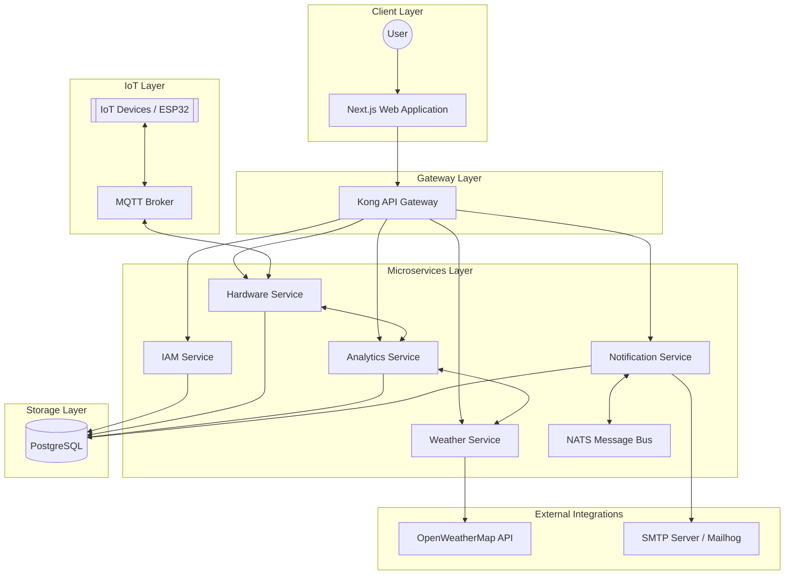

# AgriWizard: Smart Greenhouse Management System Documentation

AgriWizard is a comprehensive, enterprise-grade IoT platform designed for precision agriculture and smart greenhouse management. It leverages a microservices architecture to provide a scalable, resilient, and highly available system for monitoring and controlling agricultural environments.

---

## 1. System Architecture

AgriWizard follows a modern microservices pattern, decoupling functional areas into independent, containerized services.

### 1.1 High-Level Architecture Diagram



---

## 2. Component Breakdown

### 2.1 Backend Services (Go)
All backend services are written in **Go (Golang)**, optimized for performance and concurrency.

*   **IAM Service**: 
    *   Manages user authentication, registration, and role-based access control.
    *   Issues and validates JWT tokens for secure communication.
*   **Hardware Service**: 
    *   The core interface for IoT devices.
    *   Handles device registration, sensor data ingestion (via MQTT), and actuator control.
*   **Analytics Service**: 
    *   Processes historical and real-time sensor data.
    *   Provides environmental trends, health assessments, and data-driven insights.
*   **Weather Service**: 
    *   Integrates with external weather APIs (like OpenWeatherMap) to provide localized weather forecasts.
    *   Used by the Analytics service to correlate greenhouse conditions with external climate.
*   **Notification Service**: 
    *   Manages system alerts and user notifications.
    *   Uses **NATS** for internal event-driven communication and **SMTP** for email delivery.

### 2.2 Frontend (Next.js)
The user interface is built with **Next.js**, providing a responsive and modern dashboard for farmers.
*   **Technologies**: React, TypeScript, TailwindCSS, Shadcn UI.
*   **Features**: Real-time sensor dashboards, device management, historical data visualization, and alert configuration.

### 2.3 API Gateway (Kong)
**Kong** serves as the unified entry point for all client requests.
*   Handles routing to backend microservices.
*   Manages CORS, rate limiting, and centralized authentication verification.

### 2.4 IoT Firmware
The system includes firmware for ESP32/Arduino-based controllers.
*   Communicates with the Hardware Service via **MQTT**.
*   Collects data from sensors (Temperature, Humidity, Soil Moisture, Light).
*   Controls actuators (Pumps, Fans, Grow Lights).

---

## 3. Technology Stack

| Layer | Technologies |
| :--- | :--- |
| **Backend** | Go (1.22+), Gonic/Gin, GORM |
| **Frontend** | Next.js, React, TypeScript, TailwindCSS |
| **Databases** | PostgreSQL 16 |
| **Messaging** | NATS (Internal), RabbitMQ (Async tasks), MQTT (IoT) |
| **API Gateway** | Kong Gateway |
| **DevOps** | Docker, Docker Compose, GitHub Actions |
| **Cloud** | Azure (Container Apps, ACR, PostgreSQL) |
| **Documentation** | Swagger / OpenAPI 3.0 |

---

## 4. Infrastructure & CI/CD

### 4.1 Deployment Environment
The production system is hosted on **Microsoft Azure** using cloud-native services:
*   **Azure Container Apps**: Serverless hosting for microservices.
*   **Azure Container Registry (ACR)**: Private registry for container images.
*   **Managed PostgreSQL**: Scalable relational database.

### 4.2 CI/CD Pipeline
Automated workflows are managed via **GitHub Actions** (`ci-cd.yml`):
1.  **Continuous Integration**: Automated linting (`golangci-lint`) and unit testing on every PR and push.
2.  **Continuous Deployment**: 
    *   Builds Docker images for all services.
    *   Pushes images to Azure Container Registry.
    *   Deploys/Updates revisions in Azure Container Apps.
    *   Includes an **automatic rollback** mechanism if a deployment fails or health checks don't pass.

---

## 5. Local Development Setup

The system is fully containerized, allowing for a seamless local development experience using **Docker Compose**.

### Prerequisites
*   Docker & Docker Compose
*   Go 1.22+ (for local development)
*   Node.js & npm/bun (for frontend development)

### Running the System
```bash
# Start all services
make up

# Rebuild and start
make rebuild

# View logs
make logs

# Run tests
make test
```

### Accessing the System
*   **Web Dashboard**: `http://localhost:3000`
*   **API Gateway**: `http://localhost:8000`
*   **API Documentation (Swagger)**: `http://localhost:8090`
*   **Email UI (Mailhog)**: `http://localhost:8098`
